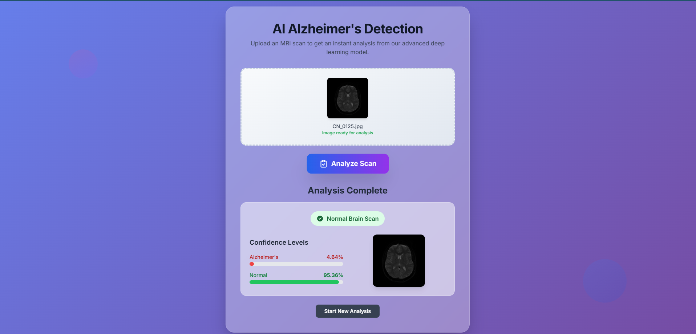

# Alzheimer's Disease Detection from MRI Scans
This project is an end-to-end machine learning application designed to classify brain MRI scans into two categories: Cognitively Normal (CN) and Alzheimer's Disease (AD). The project utilizes a custom deep learning model featuring a ContinuousLayer and is deployed as a user-friendly web application using Flask.

The entire workflow, from data ingestion to model training and evaluation, is managed and versioned using DVC, ensuring full reproducibility.

## Project Workflow
This project is structured as a modular, multi-stage pipeline. Each stage is self-contained and can be reproduced independently.

**Data Ingestion:**

Downloads the dataset from a specified source (Google Drive).

Extracts the raw image files.

**Data Transformation:**

Loads the raw images and their labels (AD, CN).

Balances the dataset by down-sampling the majority class to prevent model bias.

Resizes all images to a consistent size (224x224).

Splits the data into training and testing sets.

**Base Model Preparation:** 

Builds the custom Keras model architecture, which includes the novel ContinuousLayer.

Saves the uncompiled model structure as an artifact.

**Model Training:**

Loads the prepared base model.

Compiles the model with the custom VariationalLoss and Adam optimizer.

Sets up data generators with optional augmentation for training.

Trains the model and saves the final, trained model weights.

**Model Evaluation:**

Loads the trained model.

Evaluates its performance on the unseen test set.

Calculates and saves key metrics like loss and accuracy.

Generates a classification report and a confusion matrix for detailed performance analysis.

**Prediction & Deployment:**

A Flask web application provides a simple user interface.

Users can upload an MRI scan.

The application uses a dedicated prediction component to load the model, preprocess the image, and return a prediction with class probabilities.
## Project Structure
```
Alzheimers_Detection_Model/
│
├── .dvc/               # DVC's internal tracking folder
├── .git/               # Git's internal tracking folder
├── artifacts/          # Stores all output files (data, models)
│   ├── data_ingestion/
│   ├── data_transformation/
│   ├── model_evaluation/
│   ├── model_training/
│   └── prepare_base_model/
│
├── config/             # Contains configuration files
│   └── config.yaml
│
├── logs/               # Stores log files from pipeline runs
│
├── src/                # Main source code package
│   └── alzheimer_classifier/
│       ├── __init__.py
│       ├── components/ # Core logic for each pipeline step
│       │   ├── __init__.py
│       │   ├── data_ingestion.py
│       │   ├── data_transformation.py
│       │   ├── model_evaluation.py
│       │   ├── model_training.py
│       │   ├── prepare_base_model.py
│       │   └── prediction.py
│       ├── config/     # Configuration manager
│       │   └── configuration.py
│       ├── constants/  # Project constants
│       │   └── __init__.py
│       ├── entity/     # Data entity definitions
│       │   └── config_entity.py
│       ├── pipeline/   # Scripts to orchestrate each stage
│       │   ├── __init__.py
│       │   ├── stage_01_data_ingestion.py
│       │   ├── stage_02_data_transformation.py
│       │   ├── stage_03_prepare_base_model.py
│       │   ├── stage_04_model_training.py
│       │   └── stage_05_model_evaluation.py
│       └── utils/      # Utility functions
│           └── common.py
│
├── static/             # Stores static files for the web app (e.g., uploads)
│   └── uploads/
│
├── templates/          # Contains HTML files for the web app
│   └── index.html
│
├── tf_env/             # Your Python virtual environment
│
├── .gitignore          # Tells Git which files to ignore
├── app.py              # The Flask web application server
├── dvc.yaml            # The DVC pipeline definition file
├── main.py             # Manual script to run the full training pipeline
├── params.yaml         # Hyperparameters for the model
├── README.md           # Project documentation
├── requirements.txt    # List of Python dependencies
└── setup.py            # Makes the 'src' code installable
```

## Sample Output
The final output is a clean web interface where a user can upload an MRI image and receive a classification. The result displays the predicted class, the probabilities for both "Normal" and "Alzheimer's", and shows the uploaded image.

Input image-
Output image-

## Installation and Setup Guide
Follow these steps to set up and run the project locally.

**Prerequisites**
Git

Python 3.8+

A virtual environment tool (like venv or conda)

**1. Clone the Repository**
git clone https://github.com/your-username/Your-Repo-Name.git
```
cd Your-Repo-Name
```

**2. Create a Virtual Environment**
It's highly recommended to use a virtual environment to manage project dependencies.

 Using venv (recommended)
```
python -m venv tf_env
.\tf_env\Scripts\activate
```

**3. Install Dependencies** 
Install all the required Python packages from the requirements.txt file.
```
pip install -r requirements.txt
```
**4. Install the Local Package**
To make the alzheimer_classifier source code available for import, install it in editable mode.
```
pip install -e .
```
How to Run the Project
There are two main ways to run this project: running the training pipeline or running the web application for prediction.

**1. Running the Training Pipeline**
This project uses DVC to manage the end-to-end training pipeline.

**Initialize DVC (only once):**
```
dvc init
```
**Run the full pipeline:**
This command will execute all stages defined in dvc.yaml (data ingestion, transformation, training, and evaluation), skipping any stages that are already up-to-date.
```
dvc repro
```
**2. Running the Web Application**
To use the trained model for predictions, run the Flask web application.
```
python app.py
```
After running the command, open your web browser and navigate to:
http://127.0.0.1:8080

You will see the web interface where you can upload an MRI image to get a classification.

## Future Enhancements
This project provides a solid foundation that can be extended in several ways:

**Multi-Class Classification:** Extend the model to classify intermediate stages of cognitive decline, such as Mild Cognitive Impairment (MCI).

**Experiment Tracking:** Integrate tools like MLflow or Weights & Biases to log experiments, track metrics, and manage model versions systematically.

**Cloud Deployment:** Deploy the Flask application to a cloud service like AWS, Google Cloud, or Heroku to make it publicly accessible.

**Data Versioning with DVC:** Set up a DVC remote (e.g., Google Drive, S3) to version control the dataset and model artifacts, allowing for full reproducibility and collaboration.
